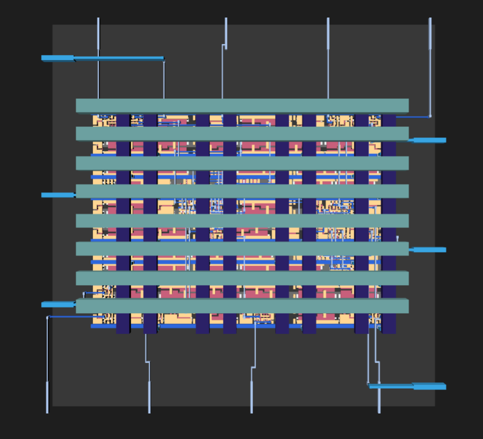
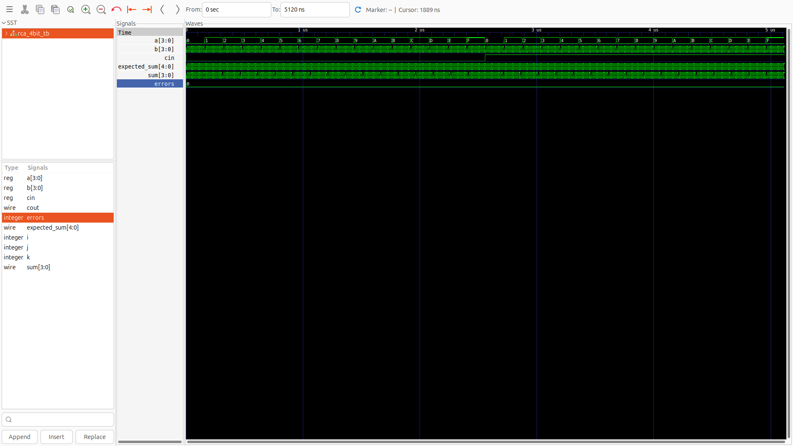
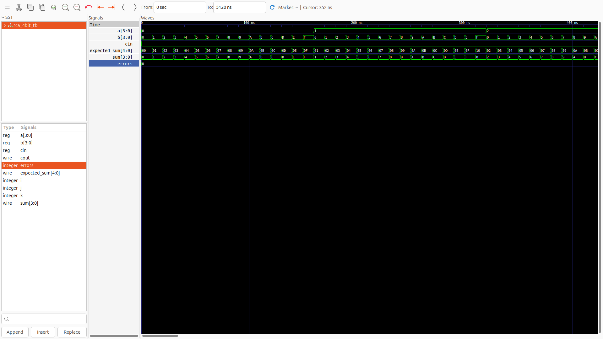
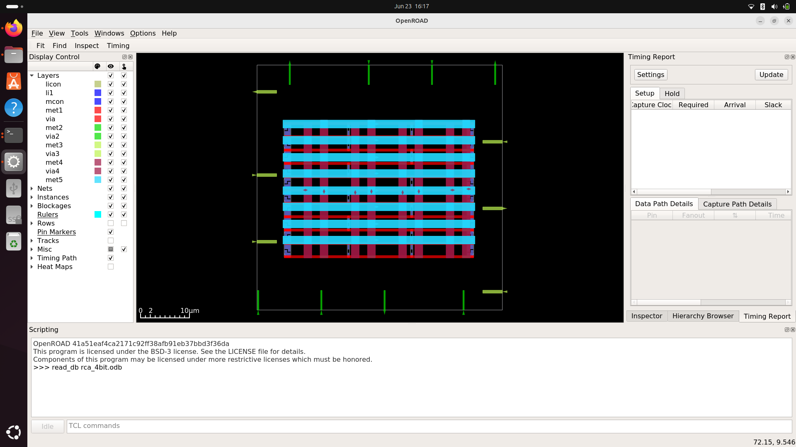
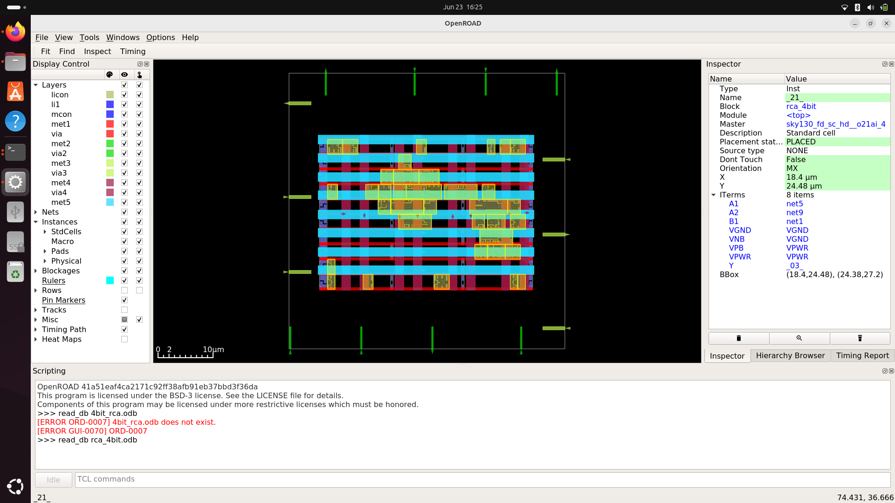
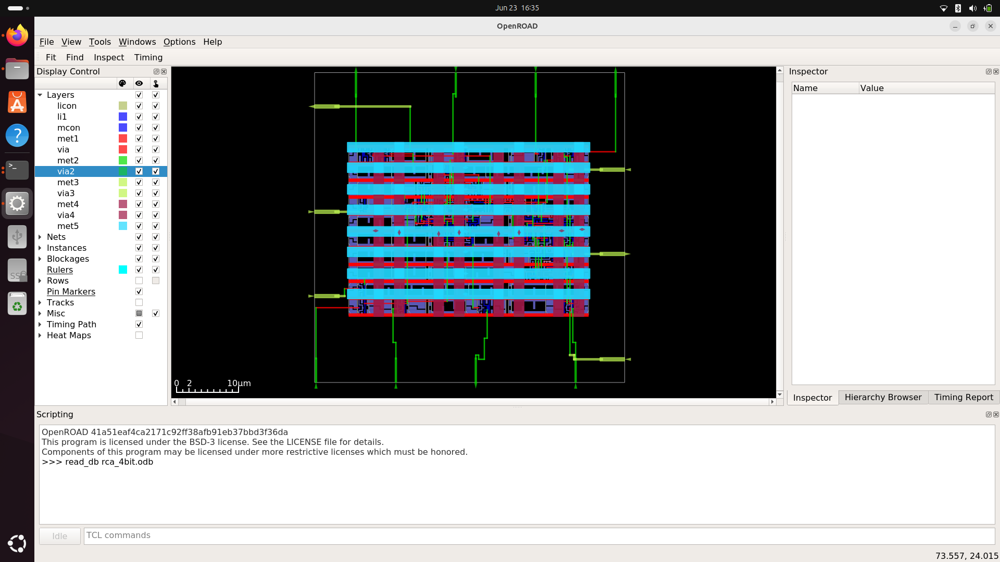
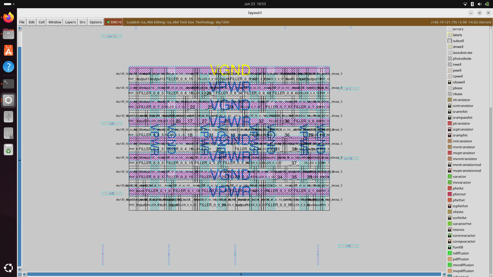

# Ripple-Carry-Adder-from-RTL-to-GDSII-using-opensource-VLSI-tools


Welcome to the Ripple Carry Adder physical design project! This repository documents the complete journey of a 4-bit Ripple Carry Adder from behavioral Verilog code to a fully routed, manufacturing-ready GDSII layout.

This project was built entirely using the open-source EDA toolchain provided by OpenLane, targeting the SkyWater 130nm (Sky130) Process Design Kit (PDK).




# 🛠️ Tools & Technologies

Process Node: SkyWater 130nm (sky130A)

Logic Simulation: Icarus Verilog (iverilog) & GTKWave

Synthesis: Yosys & abc

Floorplanning, Placement & CTS: OpenROAD

Routing: FastRoute (Global) & TritonRoute (Detailed)

Physical Verification (DRC/LVS): Magic & Netgen

Static Timing Analysis (STA): OpenSTA

Layout Viewer: KLayout / Magic

# 📖 The RTL-to-GDSII Flow & Visual Journey

Here is a step-by-step breakdown of the automated pipeline execution, accompanied by visual evidence from the project generated via OpenROAD and Magic.

1. RTL Design & Functional Verification

The behavioral logic of the 4-bit Ripple Carry Adder was designed using Verilog. Before pushing to physical design, the logic was rigorously tested using a custom testbench to ensure proper carry propagation and sum calculations. 



2. Logic Synthesis

The Verilog code is mapped to standard cells from the Sky130 library using Yosys. The tool optimizes the combinational logic into a gate-level netlist.



3. Floorplanning & Power Delivery Network (PDN)

The core area is defined, I/O pins are placed along the boundaries, and tap/decap cells are inserted. Following this, the PDN is generated—creating the robust metal grid of VDD and GND stripes to power the core evenly.

NOTE: You can view these '.odb' files in your results of respective floorplan/placement/routing using openroad
Steps to view ```'.odb'```files:
1. open the openlane docker container using ```'make mount'```
2. Go to the path required using ```'cd /path'```
3. run ```'openroad -gui'```
4. In the openroad window give TCL command at the bottom - ```'read_db your_file_name.odb'```



4. Placement

OpenROAD assigns physical locations to the synthesized standard cells inside the defined core area. The placement is optimized to reduce total wire length and alleviate routing congestion.




5. Routing

This step physically connects the placed cells according to the netlist. It is divided into Global Routing (planning the general region for wires) and Detailed Routing (assigning exact metal layers and tracks, avoiding shorts/opens).




6. Signoff & Final Layout (GDSII)

The final and most crucial step. The design undergoes strict physical and electrical verification (DRC, LVS, and Antenna checks) to ensure manufacturability.

All reports can be found in the signoff/ and reports/ directories. The final exported blueprint is rca_4bit.gds, visualized below:



# 📁 Repository Structure

├── final/  
├── floorplan/  
├── placement/  
├── rca_screenshots/  
├── reports/  
├── routing/  
├── signoff/  
├── src/  
├── synthesis/  
├── config.json  
└── rca_4bit.gds  


# 🚀 How to Reproduce the Flow

Prerequisites

Linux OS (Ubuntu recommended)

OpenLane installed via Docker

Sky130 PDK configured

# Step 1: Run RTL Simulation

Compile
```
$ iverilog -o rca src/rca.v src/tb_rca.v
```
Execute
```
$ vvp rca
```
View Waveforms
```
$ gtkwave rca.vcd
```

# Step 2: Run the Physical Design Flow

Ensure your OpenLane environment is active, and copy this project directory into the OpenLane designs/ folder.

Launch the OpenLane Docker environment
```
$ make mount
```
Run the automated physical design flow  
```
$ ./flow.tcl -design Ripple-Carry-Adder-using-open-source-VLSI-tools
```

# 🤝 Acknowledgments

Special thanks to the open-source silicon community, the OpenROAD project, and Google/SkyWater for making these powerful tools and PDKs freely available for learning and innovation.
